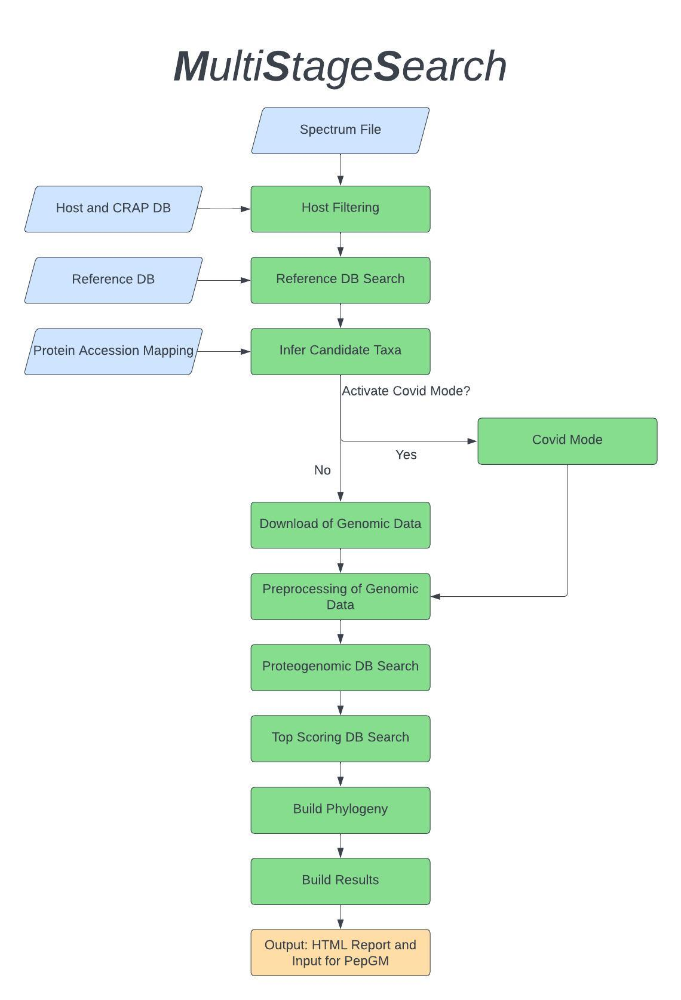

# MultiStageSearch

## Goal of this Pipeline
Databases tend to be biased. MultiStageSearch aims to overcome this challenge by addressing different bias types during the workflow and combining proteomic and genomic data to improve the results of high-resolution taxonomic inference of viral and bacterial samples.


The main workflow consists roughly of the following steps:

1. Host and Contaminant Filtering (optional)
2. Search against a reference proteome database provided by the user
3. Mapping and scoring of PSMs to find interesting species
4. Download of genomic data by one of the following approaches:
    1. Search for sequences linked to the species taxon (non-taxonomy query)
    2. Infer descendants of the given Taxon and search for sequences according to the descendant Taxon names (taxonomy query)
5. Preprocessing of the genomic data
    1. Translation of the nucleotide sequences to proteomes using a 6-frame translation approach
    2. Filter for duplicate proteomes
    3. Reduction of the search space by clustering Open-Reading-Frames
6. Search against the created proteome database of translates nucleotide sequences
7. Search against the subset of the top-scoring proteomes from the previous search (optional)
8. Creation of different plots and an interactive HTML report to evaluate the results

Additionally, another intermediate workflow is performed if SARS-CoV-2 is identified as an interesting species.
Moreover, to evaluate the suitability of a database of a search step, a database suitability metric is computed. This approach is adapted from DOI: https://doi.org/10.1074/mcp.TIR119.001752



The non-taxonomy query is independet of the strain-level NCBI taxonomy which in some cases is not up to date or not comprehensive enough. With this query, strains can be inferred that are not present in the NCBI taxonomy.

## Input:
- samples.tsv: A tab separated list with the following information for each sample:
    - sample: Name of the sample
    - mgf: Path to the mgf file
    - searchgui_par: Path to the par file for SearchGUI
    - host_fasta: Path to the fasta file containing the host database. Please make sure that the file extension is "fasta". 
    - novor_par: Path to the par file for Novor
- Additionally a fasta file containing common contaminants is required for the optional host filtering step.
- The reference proteome database that should be used for the Reference DB Search.
- A mapping of the proteins in the reference database to the corresponding Taxon-IDs
- Please make sure to adjust the config.yaml according to your paths and the NCBI account data (Mail and API key). 

## Getting started:
Please make sure that 
[SearchGUI](http://compomics.github.io/projects/searchgui) 
and 
[PeptideShaker](http://compomics.github.io/projects/peptide-shaker) and if the database suitability should be computetd [DeNovoGUI](http://compomics.github.io/projects/denovogui)
are installed and the paths are configured in the config file.\
Other dependencies (other than the paths in the config) should be handled by the workflow automatically.\
The workflow was tested using Linux.

Make sure that snakemake is installed by using conda. A tutorial for that can be found [here](https://snakemake.readthedocs.io/en/stable/getting_started/installation.html).\
The workflow can be started with the following command while being in the MultistageSearch directory:
```
snakemake --use-conda -c <n_cores> 
```

## Output:
- Plots showing statistics of the results
- Interactive HTML report aggregating important plots and logs from the different workflow steps.

## Configuration
| Parameter           | Default | Description          |
| :-------------- | :--- | :------------- |
| samples | "" | Path to the samples tsv file |
| contaminants | "" | Path to the contaminants database |
| result_dir | "results" | Relative path where the results will be stored |
| host_filtering | True | Perform host filtering |
| compute_phylogeny | True | Compute the phylogeny |
| extra_search | True | Perform the top-scoring search |
| fdr | 1 | FDR for MS2Rescore |
| peptide_fdr | 1 | FDR at peptide level for PeptideShaker |
| protein_fdr | 1 | FDR at protein level for PeptideShaker |
| psm_fdr | 1 | FDR at psm level for PeptideShaker |
| ref | "" | Path to the reference database |
| protein_accessions | "" | Path to the mapping file for the accessions. |
| scoring_engine | "PeptideShaker" | Post-processing tool used in MultiStageSearch |
| number_of_taxids | 5 | Number of candidate Taxon-IDs considered for further processing |
| max_weight_differences | 2 | Upper limit of differences for the Taxon-ID weights |
| number_of_strains | 30 | Number of strains considered for the top-scoring search |
| sqlite_db_path | "" | Path to the sqlite database file for ETE3 |
| max_number_accessions | 500 | Upper limit of downloaded nucleotide sequences |
| sequence_length_diff | 2 |  Upper limit of differences for the sequence lengths |
| max_sequence_length | 500000 | Upper limit of the sequence length to be considered for furtherprocessing |
| use_NCBI_Taxa | False | Use the taxonomy query approach |
| only_use_complete_genomes | True | Only consider sequence entries with "complete " in the title |
| orfminsize | 25 | Minimum number of amino acids an ORF should have |
| additional_parameters | "" | Additional parameters for Sixpack |
| SearchGUI | "" | Path to the SearchGUI jar file |
| PeptideShaker | "" | Path to the PeptideShaker jar file |
| SearchGUI_mem_mb | "" | Upper limit of available memory for SearchGUI in megabytes |
| PeptideShaker_mem_mb | "" | Upper limit of available memory for PeptideShaker in megabytes |
| system_latency | 1 | The time MultiStageSearch waits before continuing the workflowafter writing a file in seconds |
| APIMail | "" | User-mail of the Entrez account |
| APIKey | "" | API key of the Entrez account |
| fragment_tolerance | "" | Fragment tolerance of the experiment |
| fragmentation_method | "" | Fragmentation method used in the experiment |
| spectrum_pattern | "" | Regular expression used by MS2Rescore to identify PSMs |
| similarity_threshold | 0.98 | Lower limit of the pairwise similarity used for the filteringof duplicate proteomes |
| compute_similarity_matrix | True | Create the matrix of pairwise similarities of proteomes |
| words_blacklist | ["recombinant"] | List of words that are not considered for the comparisonof strain and isolate information |
| DeNovoGui | "" | Path to the DeNovoGui jar file |
| compute_database_suitability | True | Compute the database suitability |
| min_num_genomes_per_lineage | 3 | Lower limit of sub-lineages required to create a new binduring the splitting in the Covid mode |
| num_top_scoring_per_lineage | 3 | Number of lineages of each bin used for the aggregation of theCovid mode results |


## License
MIT License, see [here](LICENSE)

## Contact
Julian Pipart - julian.pipart@fu-berlin.de\
Tanja Holstein - Tanja.Holstein@UGent.be